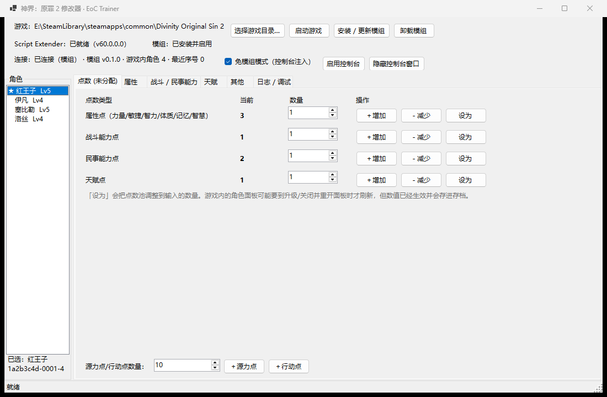
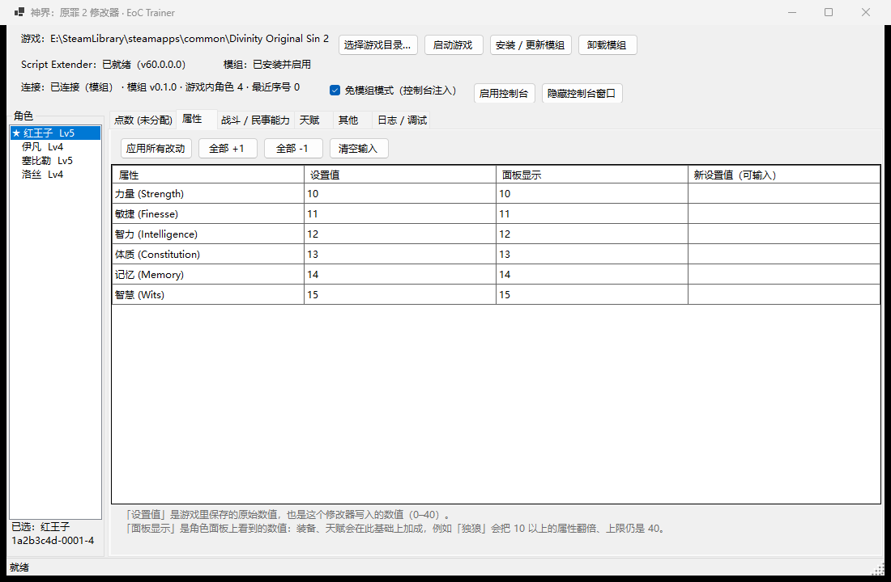
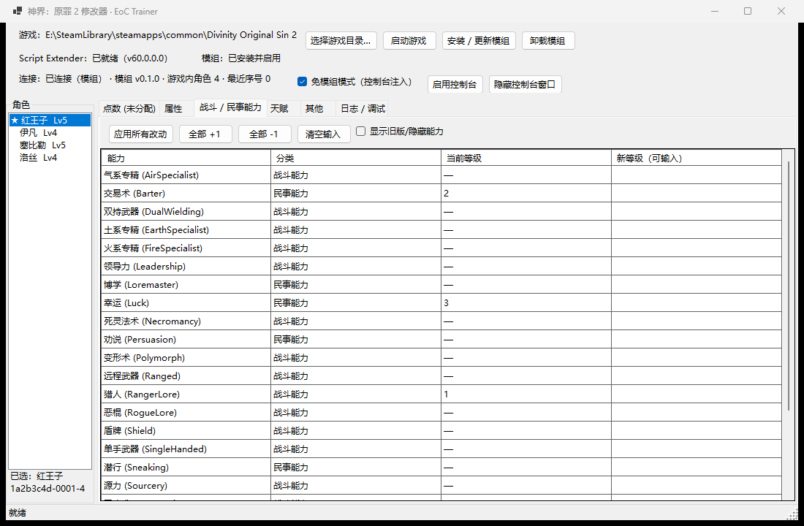
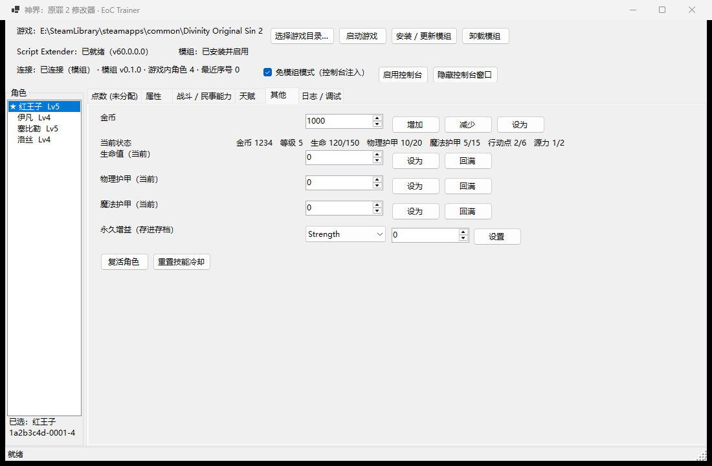

# EoC Trainer · 神界：原罪 2 运行时修改器

[中文](README.md) | [English](README.en.md)

针对《神界：原罪 2 决定版》(Divinity: Original Sin 2 - Definitive Edition) 的**运行时数值修改器**：
游戏跑着就能精确设置 / 增减队伍角色的属性、能力、天赋、点数、金币等，改完立刻生效并写进存档。

- **精确到游戏内部字段**：不是猜地址、不是覆盖显示，而是直接调用游戏自己的接口写入。
  例如把力量设为 15，游戏内部保存的就是 15。
- **两种接入方式**：装一个小模组包，或者**完全不装模组**（通过 Script Extender 的控制台把桥接代码注入游戏）。
- **零依赖打包器**：自带 DOS2 `.pak` 打包实现，不依赖任何第三方库。
- **可验证**：Lua 侧有单元测试（在游戏外跑真 Lua）、独立的 pak 校验工具、假游戏端联调工具。



---

## 目录

- [它长什么样](#它长什么样)
- [能改什么](#能改什么)
- [工作原理](#工作原理)
- [安装与使用](#安装与使用)
- [常见问题](#常见问题)
- [从源码构建](#从源码构建)
- [项目结构](#项目结构)
- [致谢](#致谢)
- [免责声明](#免责声明)

---

## 它长什么样

左边是队伍成员，右边按功能分成几页。**点数页**（顶部那张）用来改未分配的点数：



**属性页**是最有代表性的一页：`设置值` 是游戏内部保存的原始值（也是本修改器写入的值），
`面板显示` 是角色面板上实际看到的数值（含装备与天赋加成）。两个都列出来，才不会出现
"我明明设了 15，怎么显示 20" 这种误解 —— 那是独狼天赋把 10 以上的属性翻了倍。



**能力页**覆盖全部 41 项战斗 / 民事能力，支持批量 ±1 和逐项精确设置。



**其他页**放金币、生命 / 护甲 / 魔甲、源力点、行动点、永久增益，以及复活和重置技能冷却。

> 另外还有 **天赋页**（[截图](docs/screenshots/04-talents.png)，勾选式增删 + 搜索过滤）和
> **日志 / 调试页**（[截图](docs/screenshots/06-log.png)，游戏侧日志、执行任意 Lua 片段）。
>
> 截图里的角色是测试用的假数据（`tools/fake_game.py`），不需要开游戏也能看界面。

## 能改什么

| 分类 | 操作 | 底层调用 |
|---|---|---|
| 未分配点数 | 属性点 / 战斗能力点 / 民事能力点 / 天赋点的增减与设定 | `CharacterAddAttributePoint` 等 |
| 属性 | 力量、敏捷、智力、体质、记忆、智慧 精确设置（1–40） | `NRD_PlayerSetBaseAttribute` |
| 战斗 / 民事能力 | 41 项能力等级精确设置 | `NRD_PlayerSetBaseAbility` |
| 天赋 | 添加 / 移除任意天赋（含种族天赋） | `NRD_PlayerSetBaseTalent` |
| 金币 | 增加 / 减少 / 设定 | `CharacterAddGold` |
| 生命 / 物理护甲 / 魔法护甲 | 设定或回满 | `NRD_CharacterSetStatInt` |
| 源力点 / 行动点 | 增减 | `CharacterAddSourcePoints` / `CharacterAddActionPoints` |
| 永久增益 | 力量、抗性、伤害加成等 40 余项（写进存档） | `NRD_CharacterSetPermanentBoostInt` |
| 其他 | 复活角色、重置技能冷却 | `CharacterResurrect` / `CharacterResetCooldowns` |
| 调试 | 在游戏的服务端 Lua 里执行任意片段 | `Ext.Utils.LoadString` |

**关于「设置值 / 面板显示」两列**：游戏内部存的是"基础值"，角色面板显示的是加上装备、天赋之后的数值。
大部分情况两者相同；但像**独狼**这样的天赋会把 10 以上的属性翻倍（上限仍是 40），
于是设 15 会显示 20、设 25 会显示 40。两列都列出来，就一眼能看出是"设置生效了但被天赋加成了"还是"根本没写进去"。

## 工作原理

```
┌─────────────────────┐   command.json    ┌──────────────────────────────────┐
│   EocTrainer.exe    │ ────────────────► │  EoCApp.exe（游戏进程）            │
│   C# WinForms 控制端 │                   │   └─ Script Extender（必需）       │
│                     │ ◄──────────────── │        ├─ ① Lua 模组（.pak）       │
└─────────────────────┘    state.json     │        └─ ② 控制台注入的同一份 Lua  │
                                          └──────────────────────────────────┘
```

控制端本身不碰游戏进程，它只做三件事：显示界面、把操作翻译成命令、读写一个 JSON 文件。
真正执行的是**游戏进程内的 Lua 代码**，它调用游戏自己的 Osiris 接口完成写入。

| 接入方式 | 需要模组 | 需要改配置 | 新建档案 | 适用场景 |
|---|---|---|---|---|
| **① 模组包** | ✅ 一个 `.pak`（程序自动安装） | 需要（程序自动改 `modsettings.lsx`） | 需要重新登记（点一次按钮） | 想最稳 |
| **② 控制台注入** | ❌ 不需要 | 需要开一次 `CreateConsole` | 立刻可用 | 不想装模组 / 不想重启 / 新档案 |

程序会自动判断：模组在自己干活就不插手；否则自动注入桥接代码。两种方式都是每 120ms 轮询一次命令文件，
所以操作延迟基本感觉不到。

> 想深入看实现细节（DOS2 的 `.pak` 格式、控制台注入的坑、游戏内部 `PlayerUpgrade` 结构、
> 命令去重协议）→ [`docs/architecture.md`](docs/architecture.md)

## 安装与使用

### 0. 环境

| 需要 | 说明 |
|---|---|
| 游戏 | Steam 版《神界：原罪 2 决定版》(Definitive Edition)。Classic 版不支持 |
| [Norbyte's Script Extender](https://github.com/Norbyte/ositools/releases/latest) | **必须**。见下 |
| .NET | 用 Release 里的 exe **不需要**；从源码构建需要 .NET 10 SDK |

#### 安装 Script Extender

1. 到 [ositools 的 Releases](https://github.com/Norbyte/ositools/releases/latest) 下载最新版。
2. 把压缩包里的 `dxgi.dll` 解压到游戏的 `DefEd\bin\` 目录
   （即 `EoCApp.exe` 所在目录，通常在 `steamapps\common\Divinity Original Sin 2\DefEd\bin\`）。
3. 启动一次游戏 —— 扩展器会自动下载主体并生效。之后无需再管。

程序启动时会检测这一步，顶部会显示 `Script Extender：已就绪（v60.0.0.0）` 或提示缺失。

### 1. 运行修改器

下载 Release 里的 `EocTrainer.exe` 双击运行（或从源码构建）。程序会自动从 Steam 库找到游戏目录；
找不到时点「选择游戏目录…」手动指定 `Divinity Original Sin 2` 根目录。

### 2. 选择接入方式

- **想用模组模式** → 点「安装 / 更新模组」。
  程序会：把模组打包成 `.pak` 写入 `文档\Larian Studios\Divinity Original Sin 2 Definitive Edition\Mods\`、
  在你所有存档配置的 `modsettings.lsx` 里启用它（自动备份原文件）、并把 `OsirisExtensions` 写进基础模块配置。
  之后**重启一次游戏**即可。
- **想用免模组模式** → 点「启用控制台」，然后**重启一次游戏**。
  程序会打开 Script Extender 的调试控制台（游戏启动后会多一个黑窗口，可点「隐藏控制台窗口」收起来）。

### 3. 开始修改

启动游戏 → **读取存档** → 回到修改器，顶部显示 `连接：已连接（模组）` 或 `连接：已连接（控制台注入）`，
左侧列出队伍角色，就可以改了。

> - 模组包更新后需要重启游戏；控制台注入模式每次读档后程序会自动重新注入（读档会重建游戏的 Lua 状态）。
> - 角色面板可能要到重新打开面板 / 升级时才刷新显示，数值本身已经生效并会存进存档。
> - 只有**玩家角色**（4 名队友）支持修改，NPC 不行。

### 卸载

点「卸载模组」会从 `modsettings.lsx` 移除登记、删除 `.pak`、清理基础模块配置。
`modsettings.lsx` 的原始备份是同级目录下的 `*.eoctrainer.bak`。

## 常见问题

**Q：顶部一直显示「等待游戏中的桥接回应」**

- 模组模式：确认模组已安装 + **重启过游戏**，并已读取存档。
- 免模组模式：确认点过「启用控制台」并**重启过游戏**；游戏里必须已经读取存档
  （控制台只能在游戏内执行 Lua）。
- 看界面「日志 / 调试」页：里面有游戏侧日志和每次操作的返回。
  免模组模式下注入成功会显示 `console mode active`。

**Q：点了按钮但角色面板没变化**
面板需要重开才刷新。属性页的「面板显示」列可以直接对照；也可以看「日志 / 调试」页里的错误信息
（例如「已调用 CharacterAddAttributePoint，但属性点数没有变化」说明该角色不是玩家角色或已到上限）。

**Q：模组模式的 pak 提示「需要更新」**
游戏运行时 `.pak` 被占用，关掉游戏再点「安装 / 更新模组」即可。
免模组模式不受影响（注入用的是最新源码）。

**Q：会影响成就吗？**
程序写的扩展器配置里 `EnableAchievements: true`，Script Extender 会重新启用成就。

**Q：会和别的模组冲突吗？**
不会。桥接代码只在游戏每帧的 `Tick` 里轮询一个小 JSON 文件，不碰游戏逻辑，也不修改任何游戏数据。

**Q：改坏了怎么办？**
先备份存档：`文档\Larian Studios\Divinity Original Sin 2 Definitive Edition\PlayerProfiles\<配置>\Savegames`。
本修改器只写数值字段，不会破坏存档结构。

## 从源码构建

```powershell
dotnet build src\EocTrainer\EocTrainer.csproj          # 编译
powershell -File tools\publish.ps1                    # 打包单文件 exe（需要 .NET 运行时）
powershell -File tools\publish.ps1 -SelfContained      # 完全独立版（约 60 MB）

python tools\lua_harness.py                           # Lua 单元测试（用 lupa 跑真 Lua，不需要游戏）
python tools\fake_game.py --seconds 300                # 假游戏端：不开游戏也能联调界面
powershell -File tools\capture-screenshots.ps1         # 重新生成 README 截图

EocTrainer.exe diagnose            # 环境自检（游戏路径 / 扩展器 / 模组状态）
EocTrainer.exe dump-state          # 打印游戏侧状态
EocTrainer.exe op setAttribute name=Strength value=20   # 直接发一条操作
EocTrainer.exe deploy | disable | uninstall            # 模组生命周期
```

改动 Lua 后需要重新 `deploy`（模组模式）或什么都不用做（注入模式每次都会投放最新源码）。

<details>
<summary>如果你的网络会阻断 git 传输</summary>

有些网络会把 `github.com:443` 的 git 传输重置掉（网页和 API 正常）。这种情况可以用
`tools\publish-via-api.ps1` 走 REST API 上传当前提交：

```powershell
$env:GH_TOKEN = '<带 repo 权限的 token>'
powershell -File tools\publish-via-api.ps1 -Owner <用户名> -Repo <仓库名>
```

脚本按 `git cat-file` 的原始字节上传每个文件，因此远端文件与本地逐字节一致（tree SHA 相同）；
只有提交对象自身的 SHA 可能不同，因为 GitHub 会去掉提交信息首尾的空白。
</details>

## 项目结构

```
├─ mod/                                  ← 注入游戏的 Lua 桥接（两种方式共用同一份源码）
│  ├─ OsiToolsConfig.json                ← 扩展器配置（Lua + OsirisExtensions）
│  ├─ meta.lsx                           ← 模组元数据（缺 TargetModes 游戏会无视这个包）
│  └─ Story/RawFiles/Lua/
│     ├─ BootstrapServer.lua             ← 模组方式入口（Ext.Require）
│     ├─ Console.lua                     ← 注入方式入口（Ext.IO.LoadFile + LoadString）
│     └─ EocTrainer/
│        ├─ Enums.lua                    ← 生成：属性/能力/天赋枚举
│        ├─ Bridge.lua                   ← 文件桥、JSON、日志、命令去重
│        ├─ State.lua                    ← 采集状态（含 PlayerUpgrade 原始值）
│        ├─ Ops.lua                      ← 所有具体操作
│        └─ Main.lua                     ← Tick 轮询、会话激活
├─ src/EocTrainer/                       ← C# WinForms 控制端
│  └─ Core/
│     ├─ GameInstall.cs                  ← Steam 探测、扩展器/模组状态、pak 新鲜度检查
│     ├─ ModPackage.cs                   ← 自己实现的 DOS2 .pak 打包器（零依赖）
│     ├─ ModDeployer.cs / ModSettings.cs ← 安装模组、改 modsettings.lsx（自动备份）
│     ├─ ConsoleApi.cs / GameConsole.cs  ← Win32 控制台读写（注入通道）
│     ├─ ConsoleChannel.cs               ← 注入激活、Lua 模块投放
│     ├─ Bridge.cs                       ← 命令队列、状态轮询、超时重发
│     └─ Models.cs / LenientJson.cs      ← 协议 DTO + 宽容 JSON 解析
├─ tools/                                ← 开发与验证工具（见上）
└─ docs/architecture.md                  ← 逆向笔记与协议细节
```

## 致谢

- **[Norbyte's Divinity Script Extender (ositools)](https://github.com/Norbyte/ositools)** — MIT。
  本项目的全部能力都建立在它之上：`Ext.*` Lua API、`NRD_*` 扩展 Osiris 调用、
  以及负责下载扩展器主体的 `dxgi.dll` 自动更新器。没有它这个修改器不可能存在。
- **[Norbyte's LSLib](https://github.com/Norbyte/lslib)** — 用于对照验证 DOS2 的 pak 容器格式
  与 `meta.lsx` 模块元数据结构。本项目自己实现了打包器（`Core/ModPackage.cs`），没有链接 LSLib 代码；
  `tools/mod_pak.py` 是用于交叉验证的独立实现。
- **[lupa](https://github.com/scoder/lupa)** — 让 `tools/lua_harness.py` 能在游戏外
  用真实 Lua 解释器跑模组的单元测试。
- **《神界：原罪 2》© Larian Studios** — 本项目不包含任何游戏资源文件。
  属性 / 能力 / 天赋的枚举名单是游戏自身的标识符，通过 Script Extender 生成的补全文件提取，
  仅用于调用游戏本身的接口。

## 免责声明

- 仅供**单机**学习与个人使用；请勿在联机对战中影响他人体验。
- 修改存档有风险，建议先备份。
- 本项目与 Larian Studios、Norbyte 均无隶属关系。
- 协议：[MIT](LICENSE)
